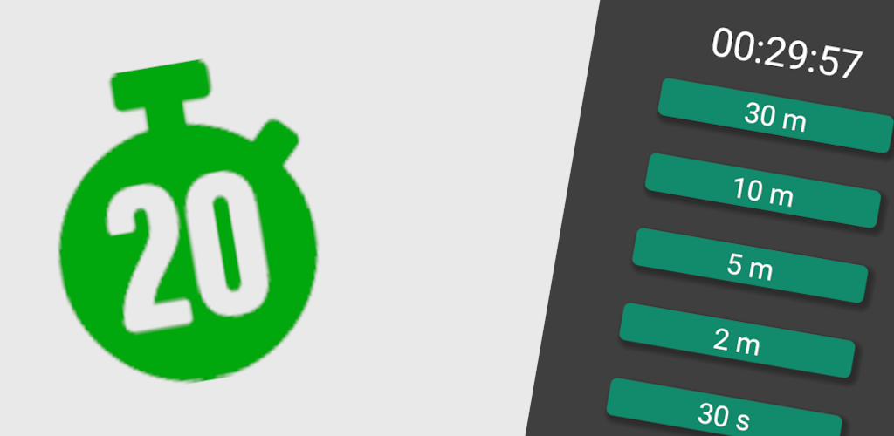

  

# Swift timer - repository for mobile

# Privacy policy

This application does not collect and send any data about you or your device. 

## This is the version of Swift Timer made using react-native

You can go to the web version [here](https://github.com/arkadiuszpasek/timer)

Mobile version does not have all of the web version's functionalities
(like choosing end sound).

#### The app is in the process of being approved for publishing to Google Play
